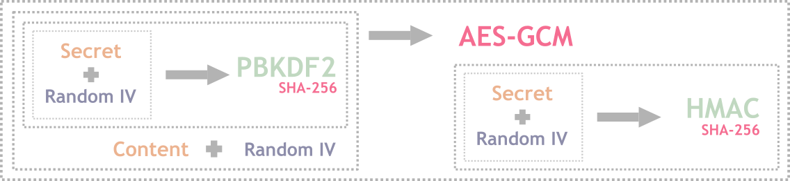

## Welcome to Nahl.PasswordManager

A password manager to manage all you password in secured and encrypted way in a single file. The file and secrets are to be stored by you. [Learn more](#how-it-works) how it is done.

There are three version of this manager 
1. [Web](https://muzammilkm.github.io/Nahl.PasswordManager/online)
2. Console
3. Desktop

You can either download and access online Web version of [Password Manager](https://muzammilkm.github.io/Nahl.PasswordManager/online) hosted on github.

# How it works
It use AES GCM encryption with random salt (96 bit) and Secret with PBKDF2 (SHA-256 with 100k Iterations). And the result of encryption is signed with HMAC (SHA-56). All these stored in the form bytes.

**Parts of Encryption data**

![[Auth Salt (128) | Secret Salt (128) | Nonce Salt(96) | Encryption Content (...) | Signature Content (256)]](assets/encryption-parts.png)

# Process

## Details
### Initialization vector (IV)
A random value to initialization vector used in encryption process to produce unique even for the same inputs.

See [http://en.wikipedia.org/wiki/Initialization_vector](http://en.wikipedia.org/wiki/Initialization_vector)